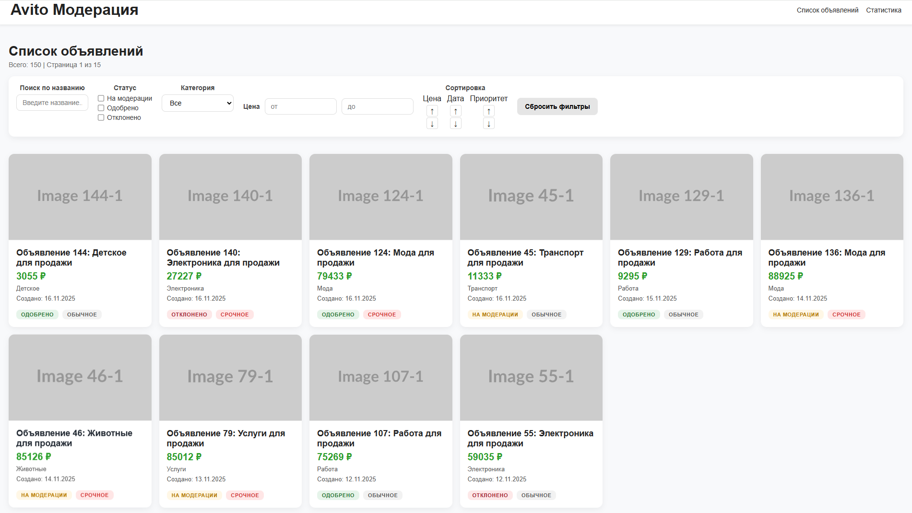
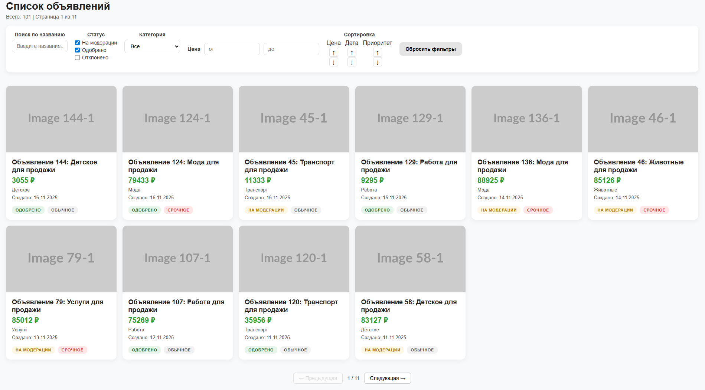
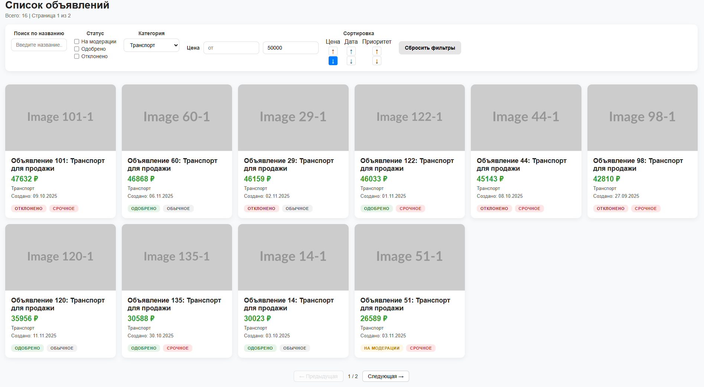
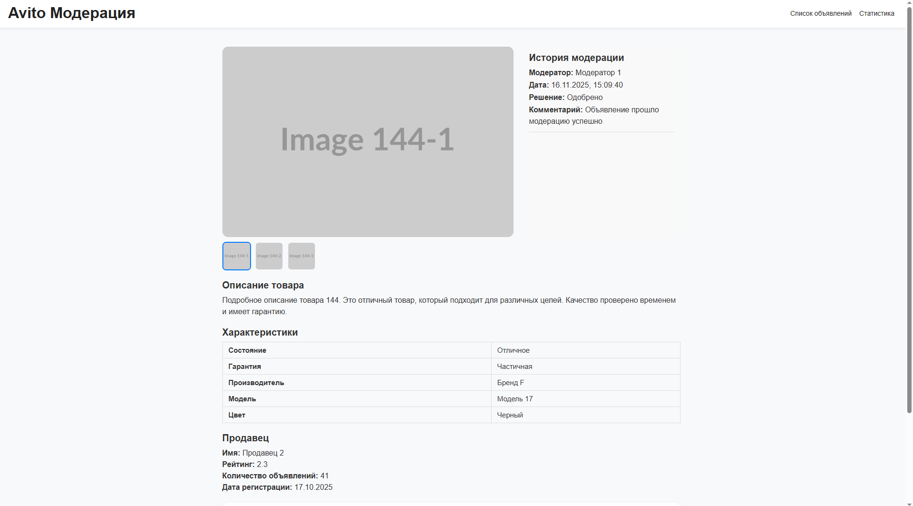
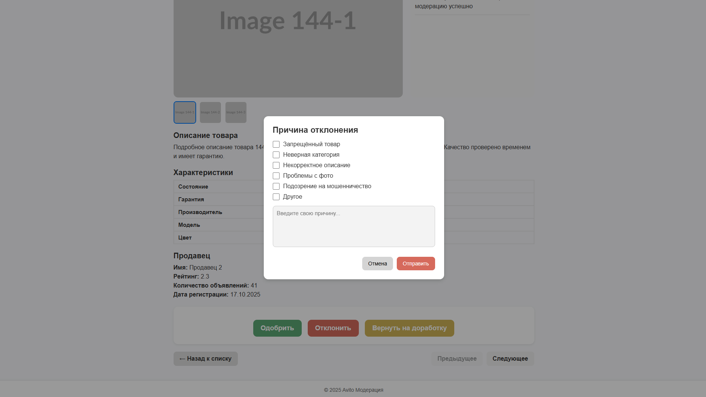
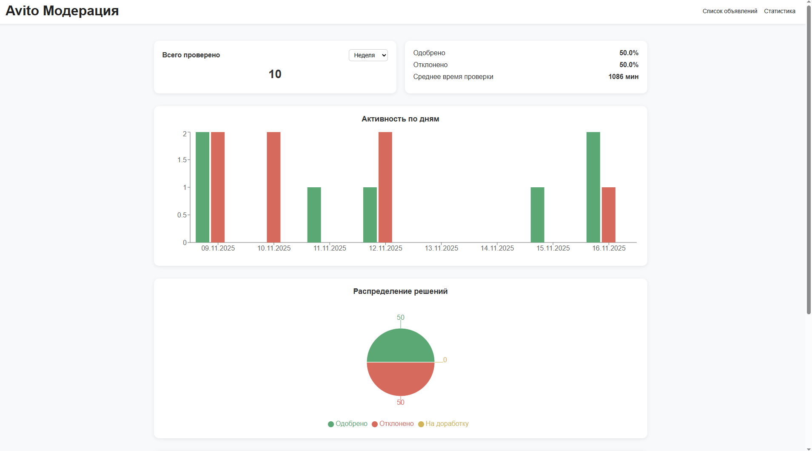
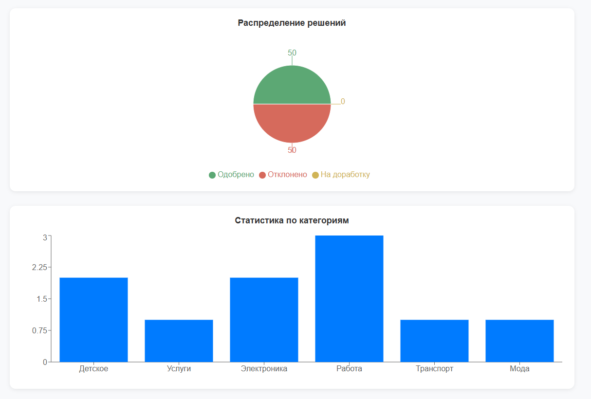
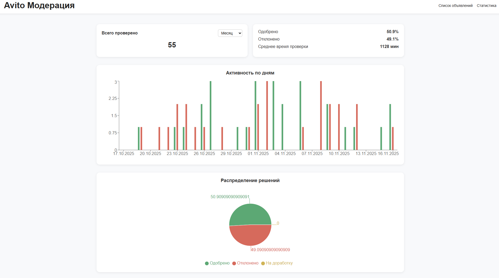

# Система управления объявлениями для модерации

 Это упрощённая версия внутренней системы, которую используют модераторы для проверки и управления объявлениями пользователей. Она представляет собой веб-приложение с интерактивной панелью модерации объявлений: весь список объявлений, детальный просмотр, история модерации и статистика. Приложение построено на **React**, использует готовый **API** и реализует обязательный функционал модерации представленный в тз, из дополнительного функционала реализован фильтр по периоду на страницы статистики модератора.

## Оглавление

- [Как запустить](#как-запустить)
- [Обоснование выбора технологий](#обоснование-выбора-технологий)
- [Скриншоты](#скриншоты)
- [Автор](#автор)

## Как запустить

### 1. Установка зависимостей:
Для установки зависимостей необходимо открыть два терминала. Один будет служить для сервера, другой для клиентской части. 

#### Сервер:

   ```
   cd tech-int3-server
   npm install
   ```

#### Клиент:

   ```
   cd client
   npm install
   ```

### 2. Запуск сервера:
Запускается через терминал, в котором мы устанавливали зависимость сервера (из папки tech-int3-server)

   ```
   npm start
   ```

Сервер доступен по адресу:

   ```
   http://localhost:3001
   ```

### 3. Запуск клиентского приложения:
Запускается через терминал, в котором мы устанавливали зависимость клиентской части (из папки client)

   ```
   npm start
   ```

Клиентское приложение открывается по адресу:

   ```
   http://localhost:3000
   ```


## Обоснование выбора технологий

- **React**: удобен для SPA-интерфейсов с динамическими списками и модальными окнами.
- **react-router-dom**: предоставляет надёжный роутинг: страницы списка, карточки, статистики.
- **Context API**: простая глобальная модель, подходит для списка объявлений. 
- **Axios**: удобен для запросов и обработки ошибок. 
- **Recharts**: простой инструмент для графиков.
- **CSS**: кастомные стили.


## Скриншоты










## Автор

- [Арсения Лушина](https://github.com/Ars2805)